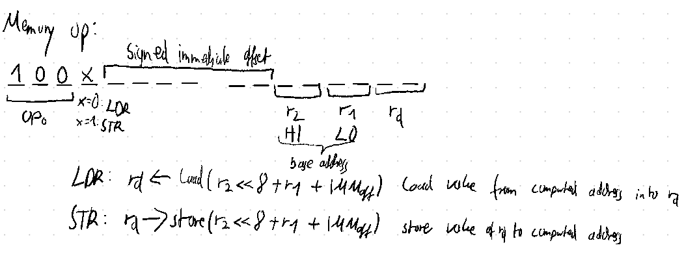

# BUGS

A semi-serious computer architecture made as an exercise in designing a fixed-width instruction set and encoding. 

I designed BUGS in the educational ['Turing Complete'](https://store.steampowered.com/app/1444480/Turing_Complete/) simulator, which (arguably over-)simplifies some aspects computer architecture. It also features a mostly nice UI and input experience. This made my goal of designing my own ISA while refreshing and deepening my computer architecture knowledge approachable, although I would probably not design another more serious and performance-oriented architecture using Turing Complete. Both due to the simplifications (e.g. regarding the clock), and its limitations, e.g. with the built-in 'Program' component.

## Files

The `component_factory` and `architecture` folders in this repo belong into the `schematics` folder in the Turing Complete data directory. I've included a verilog export of the most recent version at the time of creating this repo, but I can't guarantee I'll keep it up to date.

## BUGS-Architecture Reference Manual

The architecture is somewhat of a mix of 8- and 16-bit:
- 8-bit registers
- 64KiB of byte-addressable memory, i.e. 16-bit addresses
- 512B of separate program memory
    - branches index into the program memory per instruction (2 bytes), not per byte
- 16-bit instruction width

Other core features and specifications:
- four 8-bit registers
- instructions are stored in little endian
- lots of inspiration taken from ARM, because it's great :)
- the ALU uses flags. Only the carry (CF), sign (SF), and zero (ZF) flags are implemented. The CMP instruction should be used prior to a branch.

### Instruction Set
I have hand-written documentation for the instruction set for myself, which I will share here for completeness' sake.

The general format of the instructions is as follows:

For extensibility (as if it was necessary :)), $\text{op}_0=0$ is reserved:

---

The ALU supports a total of 12 operations, for operations that have two source operands (all but the shift, not, and negate operations), it can either use a 3-address form, or a 4-bit signed immediate as a second operand:

In order the ALU operations are
- $\texttt{ADD } r_d, r_1, r_2$ --- Does $r_d=r_1+r_2$. Sets flags
- $\texttt{ADC } r_d, r_1, r_2$ --- Does $r_d=r_1+r_2+CF$ (the carry flag). Sets flags
- $\texttt{SUB } r_d, r_1, r_2$ --- Does $r_d=r_1-r_2$. Sets flags
- $\texttt{CMP } r_1, r_2$ --- Does $r_1-r_2$. Sets flags
- $\texttt{NEG } r_d, r_1$ --- Does $r_d = -r_1$.
- $\texttt{SLR } r_d, r_1$ --- Does $r_d = (r_1 >> 1)$ `&` $\texttt{0x7f}$ (i.e. a logical shift right).
- $\texttt{SAR } r_d, r_1$ --- Does $r_d = (r_1 >> 1)$ (i.e. an arithmetic shift right, shifting in the sign bit).
- $\texttt{SLL } r_d, r_1$ --- Does $r_d = (r_1 << 1)$ (i.e. a logical shift left).
- $\texttt{AND } r_d, r_1, r_2$ --- Does $r_d = r_1$ `&` $r_2$.
- $\texttt{OR } r_d, r_1, r_2$ --- Does $r_d = r_1$ `|` $r_2$.
- $\texttt{XOR } r_d, r_1, r_2$ --- Does $r_d = r_1$ `^` $r_2$.
- $\texttt{NOT } r_d, r_1$ --- Does $r_d = r_1$ `^` $\texttt{-1}$
- 4 ALU opcodes remain reserved
- note that as stated above, $r_2$ can be replaced with a 4-bit signed immediate in all of these cases.
- Footnote: Damn Github for not supporting \texttt{\&}

---

For control flow, 2 unconditional branches, including `BL` for ARM-style branching + linking are available. There are an additional 10 conditional branches (based on flags):

---

To load registers with immediates larger than 4-bits, the Move Immediate instruction is available:

- e.g. $\texttt{MOV } r_d, \texttt{0xff}$.
- the first bit after $op_0$ is always 1. 0 in this bit is reserved for a future register to register move. This would only be done to improve performance, as register to register moves are available through the ALU, e.g. by doing $\texttt{ADD }r_d, r_1, 0$. Any assembler has the authority to encode $\texttt{MOV }r_d, r_1, r_2$ however they see fit.

---

Load and store instructions operating on the 64KiB of memory are available:

They use two source registers, $r_1, r_2$ to construct a 16-bit address. $r_d$ serves as the register to load to or to store from. A 6-bit signed immediate offset to the base address is available.

---

All other encodings are reserved.

### Design principles & reflections
- I chose 8-bit as the register width to try to keep things simple, but later desired some greater flexibility (like 64KiB of memory, instead of 256B).
- As the simulator's program component is the only one supporting comfortable assembly programming with custom mnemonics, but is not integrated into the main RAM, the choice of a Harvard architecture is heavily favored, so I reluctantly obliged.
- The number of registers (4) is this low, as I wanted to use a 3-address form for most of the instructions and thus 2 bits to address each register seemed optimal. It is of course a very severe practical limitation, but as this whole thing was more about designing an instruction set and encoding than practical application, I thought the trade-off was sensible in this case.
- The architecture was named for the 'Branch Unsigend Greater Strict' (BUGS) instruction.
- Overall, I consider the project a success, it was a lot of fun to design and build, and I (partially re-)learned a bunch. I am of the opinion that you never know if you've really understood something until you've implemented it yourself. (Footnote: My brain tells me it's time to really make sure I've understood pipelining...). The only gripes I have with the architecture are the clunky memory instructions, each of which utilizes 3 out of the 4 available registers, and the small program and register sizes. This could be mostly remedied by 16-bit registers, which I would consider the spiritual '2.0' version of BUGS; I don't see much to be learned from implementing it though. I would much rather implement another architecture from the ground up in a more realistic simulator, with more attention towards timing, clock cycles, etc.and pipelining maybe
